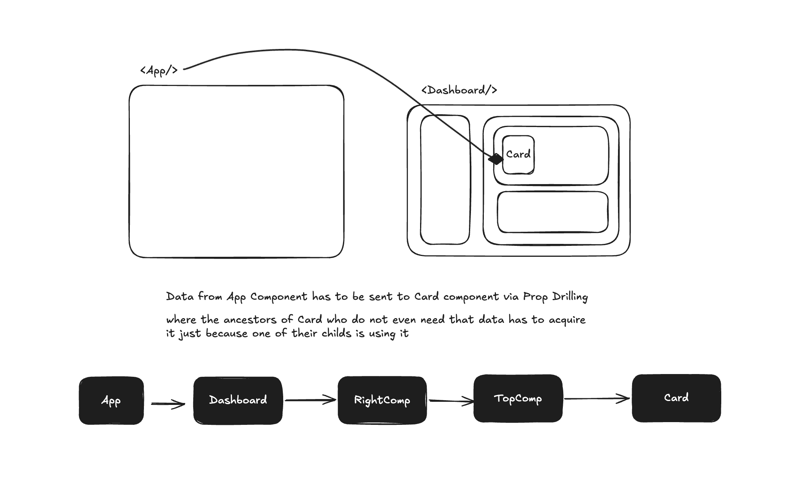
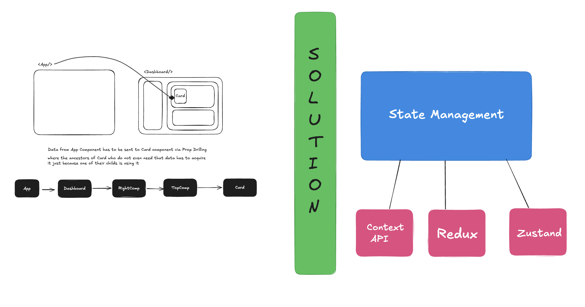
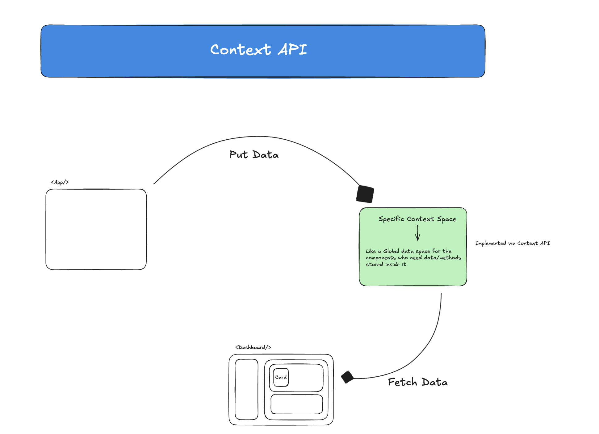

# Context API

1. As applications grow, data often needs to be shared between multiple Components.
2. Initially, data is passed from Parent to Child using **Props**.
3. This works well for small applications but becomes difficult when deeply nested Components need access to the same data.

## The Problem



The image above demonstrates a common React problem known as **Prop Drilling**.

### Prop Drilling

Suppose a deeply nested Component needs access to user information.

```text
App
 ↓
Navbar
 ↓
Sidebar
 ↓
Settings
 ↓
Profile
```

Using Props:

```text
App
 ↓ user
Navbar
 ↓ user
Sidebar
 ↓ user
Settings
 ↓ user
Profile
```

Even Components that do not need the data are forced to receive and forward it.

This leads to:

* Unnecessary Props
* Difficult Maintenance
* Poor Scalability

## Traditional Solutions



Before Context API, developers generally had two options:

### Option 1

Continue passing Props through every intermediate Component.

### Option 2

Use a dedicated state management library such as:

* Redux
* Zustand
* MobX

For smaller applications, both approaches may feel excessive.

This is where Context API becomes useful.

# Context API



* Context API is React's built-in solution for sharing data across Components.
* It allows Components to access shared data directly without manually passing Props through every level.
* Context API is commonly used for:
  * Authentication
  * Themes
  * User Information
  * Language Preferences
  * Global Settings

### Flow

```text
Context Created
       ↓
Provider Supplies Data
       ↓
Components Consume Data
```

# Steps To Use Context API

## Step 1 : Create Context

The first step is creating a Context.

```js
import { createContext } from "react";

const UserContext = createContext();

export default UserContext;
```

### What Does createContext() Do?

* It creates a shared data container.
* Components connected to this Context can access its data.

Think of it as:

```text
A Shared Data Channel
```

between Components.

# Step 2 : Configure The Provider

Creating a Context alone is not enough.

The Context also needs a Provider that supplies the actual data.

```js
import React, { useState } from "react";
import UserContext from "./UserContext";

const UserContextProvider = ({ children }) => {

    const [user, setUser] = useState(null);

    return (
        <UserContext.Provider value={{ user, setUser }}>
            {children}
        </UserContext.Provider>
    );
};

export default UserContextProvider;
```

## Why Is State Defined Here?

```js
const [user, setUser] = useState(null);
```

The Provider acts as the owner of the shared state.

Since multiple Components need access to:

```text
user
setUser
```

it makes sense to store that state inside the Provider and distribute it from there.

### Flow

```text
Provider Owns State
         ↓
Shares State
         ↓
Consumer Components
```

## Why Is The value Prop Used?

```js
<UserContext.Provider
    value={{ user, setUser }}
>
```

The `value` prop is how data is supplied to the Context.

Whatever is placed inside:

```js
value={...}
```

becomes available to all Components consuming that Context.

In this case:

```js
value={{
    user,
    setUser
}}
```

allows Components to:

* Read User Data
* Update User Data

## Why Is {children} Used?

```js
const UserContextProvider = ({ children })
```

`children` represents whatever Components are wrapped inside the Provider.

Example:

```js
<UserContextProvider>
    <Login />
    <Profile />
</UserContextProvider>
```

React internally passes:

```js
children = (
    <>
        <Login />
        <Profile />
    </>
)
```

Rendering:

```js
{children}
```

ensures those Components appear on the screen.

Without it, the wrapped Components would never render.

# Step 3 : Consume Context Using useContext()

Any Component requiring access to Context can use:

```js
useContext()
```

### Syntax

```js
const data = useContext(UserContext);
```

* `useContext()` accepts the Context object.
* React returns whatever was supplied through the Provider's `value` prop.

# Writing Data To Context

Example from Login Component:

```js
const { setUser } = useContext(UserContext);
```

```js
setUser({
    username,
    password
});
```

### Flow

```text
Login Component
        ↓
setUser()
        ↓
Context Updated
        ↓
All Consumers Receive Updated Data
```

# Reading Data From Context

Example from Profile Component:

```js
const { user } = useContext(UserContext);
```

```js
if (!user)
    return <div>Please Login</div>;
```

```js
return <div>Welcome {user.username}</div>;
```

The Component can directly access the shared data without receiving it through Props.

### Flow

```text
Context
   ↓
useContext()
   ↓
Read Data
   ↓
Render UI
```

# Behind The Scenes

Whenever:

```js
setUser(...)
```

is called,

React:

```text
Updates Context Value
          ↓
Finds All Consumers
          ↓
Re-renders Them
```

This ensures every Component receives the latest Context data.

# Summary

* Context API helps solve Prop Drilling.
* `createContext()` creates a shared data container.
* Providers supply data through the `value` prop.
* State is usually stored inside the Provider.
* `children` allows wrapped Components to be rendered.
* `useContext()` is used to consume Context data.
* Components can both read and update Context values.
* Context API is ideal for shared application-wide data such as authentication, themes and user information.